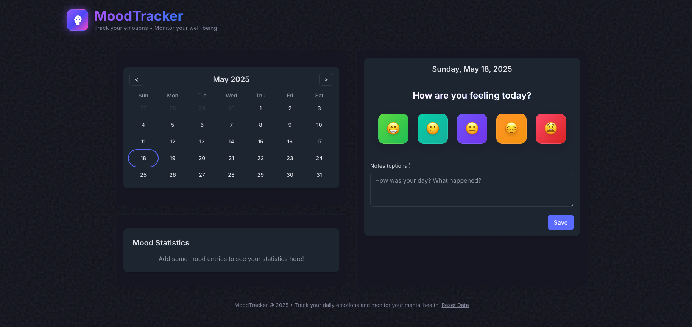

# MoodTracker

A beautiful, interactive mood tracking application that allows users to record their daily emotions with emojis and notes. The app includes a color-coded calendar and mood statistics visualization.



## Features

- 📅 **Interactive Calendar**: View your moods on a color-coded calendar
- 😊 **Emoji Selection**: Record your mood using expressive emoji buttons
- 📝 **Notes**: Add additional context about your day
- 📊 **Statistics**: See your mood patterns visualized over time
- 🌓 **Dark Mode**: Toggle between light and dark themes
- 💾 **Offline Storage**: All data is stored locally in your browser

## Technical Details

This application is built with:

- React with TypeScript
- Tailwind CSS for styling
- Framer Motion for animations
- date-fns for date manipulation
- Local storage for data persistence

## Getting Started

### Prerequisites

- Node.js
- NPM or Yarn

### Installation

1. Clone this repository
2. Install dependencies:
   ```
   npm install
   ```
   or
   ```
   yarn install
   ```

3. Start the development server:
   ```
   npm run dev
   ```
   or
   ```
   yarn dev
   ```

4. Open [http://localhost:3000](http://localhost:3000) in your browser

## Accessibility

This application follows WCAG 2.1 guidelines:

- Semantic HTML structure
- Proper ARIA attributes
- Keyboard navigation
- Color contrast compliance
- Screen reader friendly
- Reduced motion support

## License

This project is licensed under the MIT License - see the LICENSE file for details.

## Acknowledgments

- Emoji design inspired by [Twemoji](https://twemoji.twitter.com/)
- Calendar UI adapted from various open-source designs 